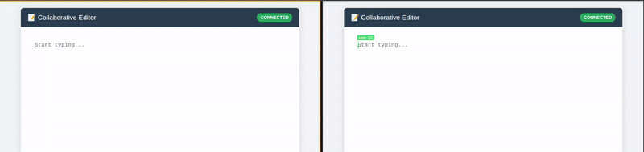

# 📝 Real-Time Collaborative Text Editor

 

A high-performance, real-time collaborative text editor (similar to Google Docs) built from scratch using **Vanilla JavaScript**, **Node.js**, **Express**, and **WebSockets**. 

Instead of using heavy libraries like Yjs or Socket.io, this project implements a custom **CRDT (Conflict-free Replicated Data Type)** system using **Fractional Indexing** to ensure eventual consistency without a central locking server.

🔗 **[Live Demo](https://coeditor-jjt8.onrender.com/)**



---

## 🚀 Key Features

* **Real-Time Synchronization:** Character-by-character syncing with sub-100ms latency.
* **Conflict-Free Editing:** Uses **Fractional Indexing (Base-93)** to mathematically guarantee all users see the same document order, even if they type offline or out of sync.
* **Multi-User Presence:** Shows remote cursors with real-time names/colors.
* **Mobile Support:** Uses a **Unified Diff** algorithm to handle complex mobile inputs like Autocorrect, Predictive Text, and Replacements.
* **Ephemeral Persistence:** SQLite (WAL Mode) backend for fast read/writes.

---

## 🛠 Tech Stack

* **Language:** JavaScript (ES6+)
* **Frontend:** Vanilla JavaScript (No frameworks), HTML5, CSS3.
* **Backend:** Node.js, Express.js.
* **Communication:** Raw WebSockets (`ws` library).
* **Database:** SQLite (Optimized with WAL mode).
* **Deployment:** Render (Cloud).

---

## 🧠 Engineering Deep Dive

This project solves several distributed system challenges manually:

### 1. The "Sequential Typing" Problem
Standard fractional indexing (e.g., using digits 0-9) runs out of precision quickly when users type sequentially at the end of a line. 
* **Solution:** I implemented **Base-93 Indexing** (using ASCII characters `!` to `~`). This provides 93 slots between any two characters, allowing for massive document growth without precision loss.

### 2. The "Autocorrect" Trap
Mobile keyboards don't just "insert" keys; they often delete and replace whole words (e.g., `teh` -> `the`).
* **Solution:** Instead of simple `input` listeners, I implemented a **Unified Diff** algorithm. It calculates the Common Prefix and Suffix to mathematically determine exactly which range was replaced, ensuring perfect sync on mobile devices.

---

## 📦 Installation & Setup

1.  **Clone the repository**
    ```bash
    git clone [https://github.com/yourusername/collab-txt-editor.git](https://github.com/yourusername/collab-txt-editor.git)
    cd collab-txt-editor
    ```

2.  **Install dependencies**
    ```bash
    npm install
    ```

3.  **Start the Server**
    ```bash
    npm start
    ```
    The app will run at `http://localhost:5000`.

---

## 🌐 Deployment

This project is configured for **Render.com**.

**Note on Database:**
By default, this app uses SQLite. On serverless/cloud platforms like Render, the filesystem is ephemeral (deleted on restart).
* **Production Fix:** The app detects the environment. If on Render, it writes to `/tmp/editor.db` to prevent crash loops.
* **Scalability:** The architecture is designed to swap SQLite for **PostgreSQL** easily for permanent persistence.

---

## 🔮 Future Improvements / Todo

- [x] **Batch Processing:** Batch text operations generated during large copy/paste events (5k+ chars) into size/time-based groups to prevent WebSocket flooding and network throttling.
- [ ] **PostgreSQL Migration:** Move from SQLite to Postgres for permanent data storage.
- [ ] **User Auth:** Add Login/Signup functionality.
- [ ] **Multiple Documents:** Support routing for different room IDs (e.g., `/doc/123`).
- [ ] **History:** Implement snapshotting for Undo/Redo functionality.


## 🤝 Contributing

Contributions are welcome! Please open an issue or submit a pull request.

**Author:** Rishabh Chandrode